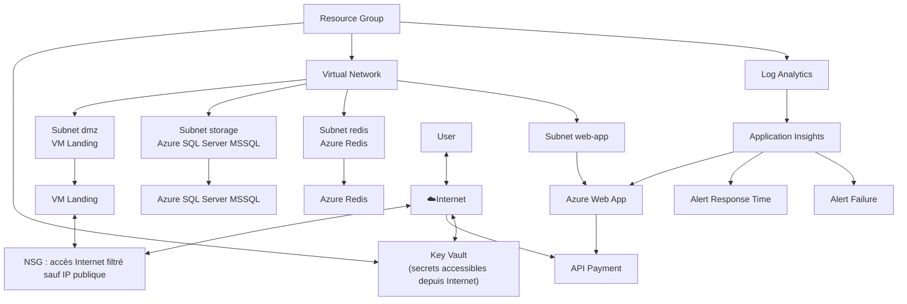

# Azure Web App

## Description

In this example, we will create an Azure Web App using Terraform.

The web app is a a simple API using Node.js and Express designed to represent a payment API. It store the transactions in the SQL Database and uses the Redis Cache to store transactions for quick access.

The infrastructure for the app includes:

- A resource group to contain all resources
- A Key Vault to store secrets
- An SQL Database to store application data
- A Redis Cache for caching application request
- The Web App itself with the app service plan
- An azure VNet to connect all resources
  - A subnet delegated to the Web App for private access to the vnet
  - A subnet for the SQL Database
  - A subnet for the Redis Cache
  - A subnet DMZ for an access to the VNet and debug/test the SQL database and Redis Cache
- A landing linux VM on the DMZ subnet with SSH access
- Network Security Groups (NSGs) to control access to the DMZ landing VM
- KeyVault access policies to allow the Web App to access secrets in the Key Vault
- A Redis cache access policy to allow the Web App to access the Redis Cache
- A log analytics workspace to collect logs and metrics from the Web App
- An Application Insights resource to monitor the Web App
- Monitoring alerts for on application insights for the web app
  - If the API for payment fail more than 5 times in 5 minutes, an alert is triggered
  - If the API for payment take more than 2 seconds to respond, an alert is triggered

## Prerequisites

1. Have an Azure account.
2. Install Terraform on your local machine.
3. Have a resource group created in Azure where you want to deploy the resources.
4. Have a key vault created in Azure to store secrets.

## How to run this example

1. Clone the repository:
2. Navigate to the `terraform/azure/002_azure_web_app` directory.
3. Create a `terrafor m.tfvars` file with the following content:

```hcl
subscription_id                     = "YOUR_SUBSCRIPTION_ID"
object_id                           = "YOUR_OBJECT_ID"
key_vault_name                      = "YOUR_KEY_VAULT_NAME_TO_IMPORT"
resource_group_name                 = "YOUR_RESOURCE_GROUP_NAME_TO_IMPORT"
service_plan_name                   = "service-plan-name-you-want"
web_app_name                        = "web-app-name-you-want"
sql_server_name                     = "sql-server-name-you-want"
sql_db_name                         = "sql-db-name-you-want"
redis_cache_name                    = "redis-cache-name-you-want"
app_insights_name                   = "app-insights-name-you-want"
log_analytics_name                  = "log-analytics-name-you-want"
vnet_name                           = "vnet"
vnet_address_spaces                 = ["10.0.0.0/16"]
subnet_name                         = "subnet-name-you-want"
subnet_address_prefixes             = ["10.0.1.0/24"]
sql_server_pe_name                  = "sql-server-pe-name-you-want"
sql_server_admin_username           = "bpeadmin"
subnet_storage_address_prefixes     = ["10.0.10.0/24"]
subnet_storage_name                 = "subnet-storage-name-you-want"
redis_pe_name                       = "redis-pe-you-want"
subnet_dmz_name                     = "subnet-dmz-name-you-want"
subnet_dmz_address_prefixes         = ["10.0.20.0/24"]
dmz_landing_vm_size                 = "Standard_B1s"
dmz_landing_vm_name                 = "dmz-landing-vm-name-you-want"
dmz_landing_vm_admin_username       = "adminuser"
subnet_cache_name                   = "subnet-cache-name-you-want"
subnet_cache_address_prefixes       = ["10.0.15.0/24"]
dmz_landing_authorized_ip_addresses = ["YOUR_IP_ADDRESS"]
webapp_action_group_name            = "bpe-action-group"
webapp_action_group_short_name      = "bpeag"
```

4. Run `terraform init` to initialize the Terraform configuration.
5. Run `terraform plan -out=tfplan` to see the resources that will be created.

## Architecture



## Tests

You can test the API response time with the script in `tests/test_api_response_time.sh`. This script will send a request to the API and measure the response time.
The standard output is a formatted in CSV format and if you output to a file you can then use CSV tools to analyze the data.

If you want to test the API for 5 requests:

```bash
./tests/test_api_response_time.sh YOUR_WEB_APP_FQDN 5 > response_time_5.csv
```

You get the output in the `response_time_5.csv` file:

```csv
Request Id, Total Time (s)
3, 0.177954
4, 0.187352
5, 0.194249
2, 0.205058
1, 0.208575
```

You can do it for 2000 requests:

```bash
./tests/test_api_response_time.sh YOUR_WEB_APP_FQDN 2000 > response_time_2000.csv
```

## TODOs

1. Modify the webapp to use the Key Vault secrets.
2. Integrate KeyVault to the Vnet to access secret from the Web App in the Vnet.
3. Add cache utilization in the web app.
4. Configure contacts for action group
